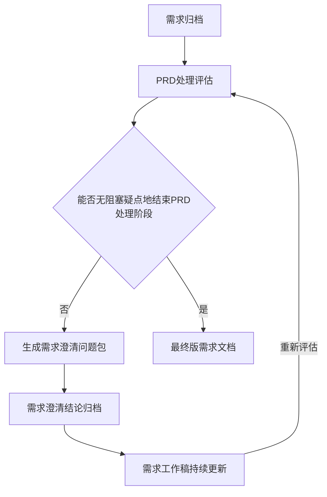

# prd-handler

`prd-handler` 是一个 Codex skill，用于把原始 PRD / 产品需求材料处理成结构化、可追溯、无阻塞疑点的最终版需求文档，供后续技术评估、技术方案设计、开发拆解和测试设计使用。

## 核心流程



当用户提交一轮澄清反馈并要求继续处理时，skill 允许执行复合流程：归档澄清结论、更新需求工作稿、重新评估，并在仍有疑点时生成下一轮澄清问题包。最终版需求文档必须由用户明确确认后生成。

## 主要能力

- 归档本地文件、目录和 HTTP/HTTPS 需求来源。
- 生成 PRD 完整性、一致性和可定版状态评估。
- 按主题批量生成澄清问题包，并为问题提供候选方案、推荐方案、依据和影响说明。
- 记录逐条确认或“批量接受推荐方案”的澄清结论。
- 维护派生的需求工作稿，不修改原始 PRD。
- 使用统一结构化模板生成最终版需求文档。
- 在用户提供代码仓库或系统材料时，只读引用现有系统事实辅助澄清。

## 文件结构

```text
prd-handler/
├── SKILL.md
├── agents/
│   └── openai.yaml
├── references/
│   ├── prd_assessment_template.md
│   ├── clarification_questions_template.md
│   ├── requirement_draft_template.md
│   └── final_prd_template.md
└── scripts/
    └── manage_prd_workspace.py
```

## PRD 工作区结构

```text
<PRD工作目录>/
├── 00-产品输入/
│   ├── 上传文件/
│   ├── 对话输入/
│   └── 来源清单.md
├── 01-PRD处理评估/
│   ├── 最新评估.md
│   └── 历史版本/
│       └── PRD处理评估-RNN.md
├── 02-需求澄清/
│   ├── 最新澄清问题包.md
│   ├── 最新澄清结论.md
│   └── 历史版本/
│       ├── 需求澄清问题包-RNN.md
│       └── 需求澄清结论-RNN.md
└── 03-需求文稿/
    ├── 需求工作稿.md
    ├── 需求文档最终版.md
    └── 历史版本/
        └── 需求工作稿-RNN.md
```

## 关键约束

- 原始产品输入只归档，不修改。
- 需求工作稿和最终版需求文档是派生产物。
- 未确认的 Agent 推断不能写成最终需求。
- 代码事实只能辅助澄清，不能替代产品目标。
- 不输出详细技术设计、人日、工期或排期，除非用户明确要求。

